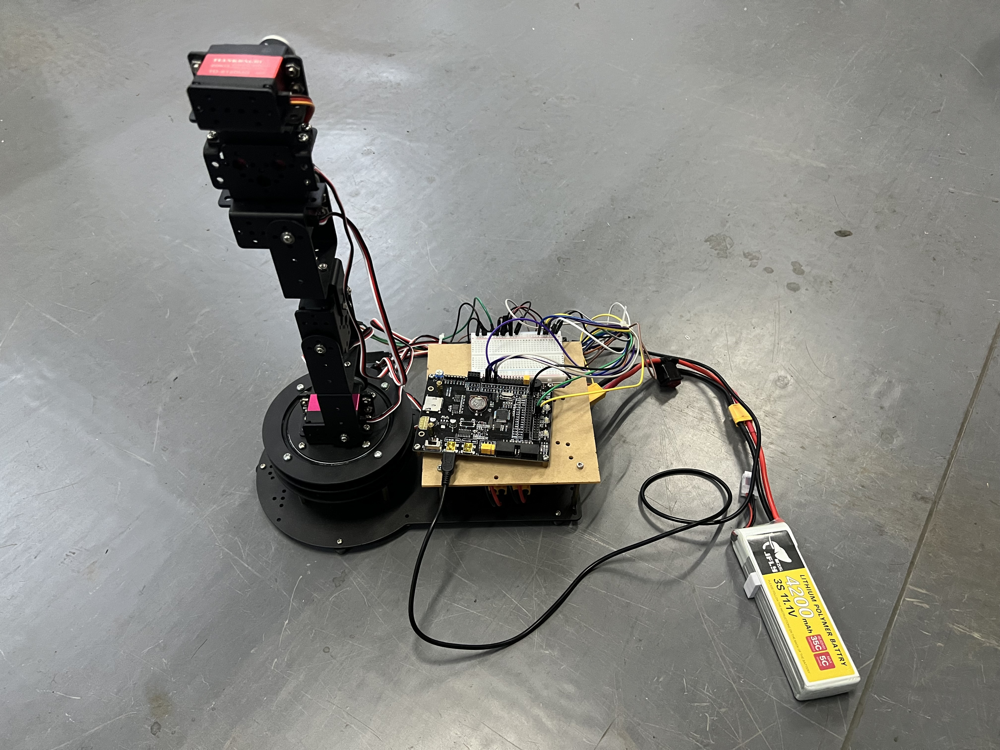
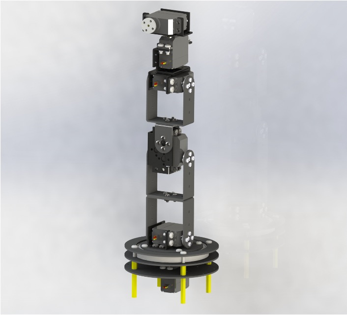
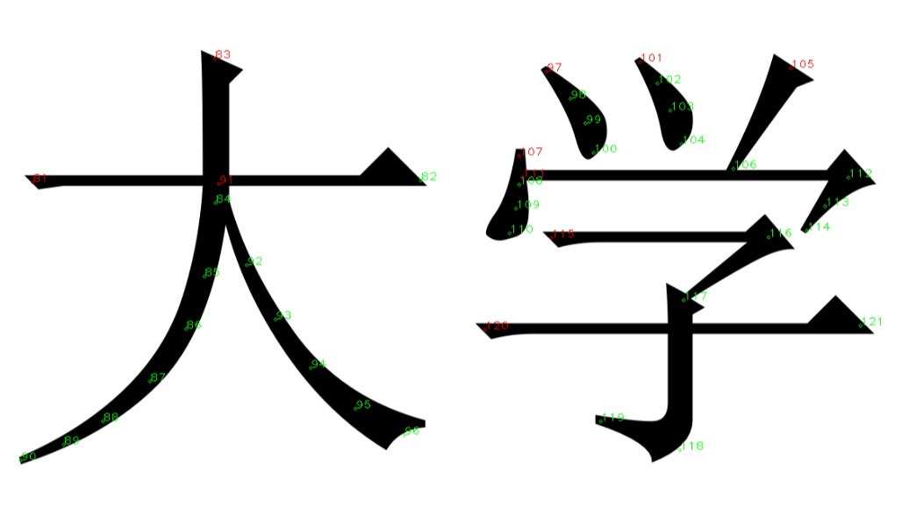

# Embedded Robot Arm
This repository is aimed for Comprehensive Training on Measurement and Control of Mechatronics Course Project at HUST.

## Overview
> In this project, the unit of length is **mm**



In this course, we were required to start with some projects that are consist of mechanics, electrical circuits, and control systems. As a result, I decided to develop a cost-effective six-axis robotic arm.

This robotic arm contains six rotatable joints, allowing it to move as flexibly as possible within the workspace. The DH parameters of the robotic arm are as follows:

**Standard DH:**
| $i$ | $d_i$ | $a_i$ | $\alpha_i$ | $\theta_i$ |
| :--- | :---: | :---: | :---: | :---: |
| 1 | 0 | -9.55 | $\pi\over2$ | $\theta_1$ |
| 2 | 0 | -104 | 0 | $\theta_2$ |
| 3 | 0 | -96.4 | 0 | $\theta_3$ |
| 4 | 0 | 0 | $\pi\over2$ | $\theta_4$ |
| 5 | 80.66 | 0 | $-{{\pi}\over{2}}$ | $\theta_5$ |
| 6 | 27.5 | 0 | 0 | 0 | $\theta_6$ |

**Modified DH:**
| $i$ | $d_i$ | $a_{i-1}$ | $\alpha_{i-1}$ | $\theta_i$ |
| :--- | :---: | :---: | :---: | :---: |
| 1 | 0 | 0 | 0 | $\theta_1$ |
| 2 | 0 | -9.55 | $\pi\over2$  | $\theta_2$ |
| 3 | 0 | 104 | 0 | $\theta_3$ |
| 4 | 0 | 96.4 | 0 | $\theta_4$ |
| 5 | 80.66 | 0 | $\pi\over2$  | $\theta_5$ |
| 6 | 27.5 | 0 | $-{{\pi}\over{2}}$  | $\theta_6$ |

In this project, I used Standard DH because it can fit my robotic arm better.

## Model
Solidworks assemble model are presented in this folder. You can easily refer to the model by opening the file `Km1机械臂完整体.SLDASM` or `Km1机械臂完整体.STEP`. I built this model with `SOLIDWORDS 2022`.



## Hardware
In this project, I used EmbedFire's STM32 board STM32F103 Mini. It has an **STM32F103RCT6**. The schematic of this board is shown in this folder.

## EmbedPrj
This code is automatically generated by `STM32CubeMX`. I also added some necessary module to communicate and drive servos.

This code is edited with `Clion`. If you want to download the code to your board, you can install `OpenOCD` and `arm-none-eabi-gcc`. Or you can choose to regenerate this code through `STM32CubeMX` to `Keil` version.

I regulated some port communication command so that people can easily debug and control it using a host computer. Some commands are as follows:

The command start with `+` and end with `,`

```+led,0,1, # open the led0```

```+ser,0,1000, # set the servo0 pulse to 1000 (1ms)```

```+servos,pulse0,pulse1,pulse2,pulse3,pulse4,pulse5, # control all the servos together```

Please note that I used a different servo at the sixth position. So the code will be a little different in this section.

## RobotKinetic
> This code requires `eigen`. 

This code is aimed to calculate the inverse kinetic solution. You can use it in a simple way.

1. Input the DH parameter.
2. Input the homogeneous transformation matrix or just pose `(x, y, z, rx, ry, rz)` to function `inverse_kine`.
3. Print the result.

**Please note that this code is not required. This code is only intended for validation of inverse kinematic solutions in a non-ROS environment.**

## RosPrj
> This code requires `eigen` and `ROS`.

This code is aimed to control the robotic arm. You can use it in a simple way.

- Input the DH parameter.
- Initial the seiral function.
- Use `moveJ` to move to a designated pose. You can input angle, homogeneous transformation matrix or pose `(x, y, z, rx, ry, rz)`. **Please note that I do not set a limitation in angle moving way.**
- Use `moveL` to move to a designated pose. You can input angle, homogeneous transformation matrix or pose `(x, y, z, rx, ry, rz)`. **Please note that I do not set a limitation in angle moving way.**

I also added some necessary module to communicate and drive servos and achieve some interesting applications.

- In `scripts/get_pixel.py`, I used `OpenCV` to get the pixel coordinate of the object. You can add the path manually and then drive the robot arm to the designated pose through function `draw_word`.



<video src="img/controller.mp4"></video>

## Manuscript
This PDF documents my process for deriving kinematic inverse solutions. The process references this [website](https://www.cnblogs.com/mightycode/p/9095059.html).
